# MicroRust

Bu repoda mikrodenetleyiciler üzerinde Rust ile kodlama pratiklerine yer verilmesi planlanmaktadır.

- [İçerik](#microrust)
    - [Microbit Üzerinde Geliştirme](#microbit-üzerinde-geliştirme)
        - [Cihaz Hakkında](#cihaz-hakkında)
        - [Gerekli Kurulumlar](#gerekli-kurulumlar)
        - [Örnekler](#örnekler)
            - [Fist Contact](#first-contact)
            - [Debugging](#debugging)
            - [Blinking Led](#blinking-led)
            - [Blinking Led v2](#blinking-led-v2)
            - [Blinking Rust](#blinking-rust)
            - [Beep](#beep)
            - [Uart](#uart)
            - [Server](#server)
            - [Accelerometer](#accelerometer)
            - [Thermometer v1](#thermometer-v1)
            - [Thermo v2](#thermo2)
            - [Funny Led](#funny-led)
            - [Thermo Digits](#thermo-digits)
            - [Lighthouse](#lighthouse)
            - [Morse Codes](#morse-codes)
            - [Motion Sensor](#motion-sensor)
        - [Mini Sözlük](#mini-sözlük)
        - [Kaynaklar](#kaynaklar)

## Microbit Üzerinde Geliştirme

Mikrodenetleyiciler genel olarak sınırlı kapasiteye sahip, çoğunlukla işletim sistemi ile birlikte gelmeyen, çeşitli
sensörler yardımıyla çevresel ortamlardan veri toplanması gibi işlerde sıklıkla kullanılan entegre kartlardır. Portatif
ve ekonomik olmaları birçok düzeneğe dahil edilmelerini mümkün kılar. Mikrodenetleyiciler üzerine geliştirme yapmak için
farklı programlama dilleri kullanılabilir ancak **RTOS _(real-time operating system-RTOS)_** ile birlikte gelmedikleri
durumlarda bare-metal programming pratiklerini uygulamak gerekir.

Bu repoya konu olan [BBC micro:bit](https://microbit.org/) üzerinde **Python**, **Scratch**, **Microsoft Make** ile
programlama yapılabileceği gibi **C** ve **Rust** gibi dillerle de geliştirme yapmak mümkündür.

## Cihaz Hakkında

Bu repodaki örnekler **BBC Micro:bit v2.2** üzerinde geliştirilmektedir. **ARM** tabanlı **Cortex** işlemciye _(
nRF52833, Nordic Semiconductor)_ sahip olan cihaz **512 Kb Flash** ve **128 Kb Ram** belleğe sahiptir.

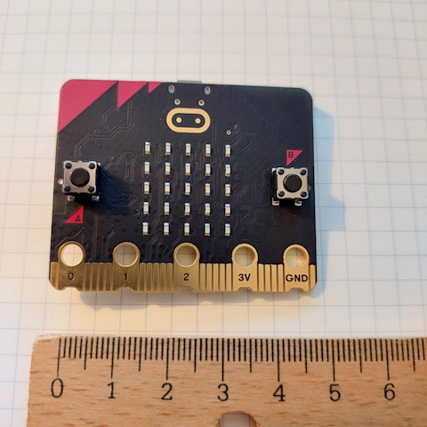

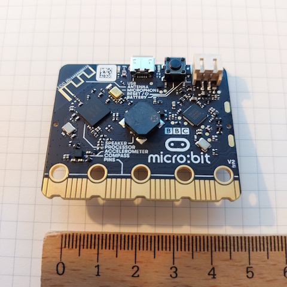

- Doğrudan Microcontroller Unit üzerinde programlama yaparken kartın donanım şema bilgilerine ihtiyaç
  duyulacaktır. [Kaynak](https://github.com/microbit-foundation/microbit-v2-hardware/blob/main/V2.00/MicroBit_V2.0.0_S_schematic.PDF)

Mikrodenetleyici USB üzerinden bilgisayara bağlanabilir. Bilgisayara bağlandıktan sonra **COM3** portundan bağlı bir
cihaz gibi de algılanır.

```bash
# Kontrol için
mode
```

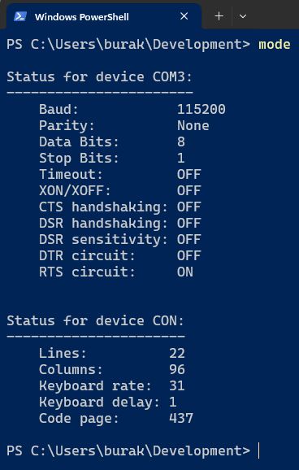

## Gerekli Kurulumlar

Örnekler **Windows 11** işletim sistemi üzerinde geliştirilmektedir.

```bash
# Sistemde rust'ın yüklü olduğu varsayılmıştır

rustup component add llvm-tools
cargo install cargo-binutils
cargo install cargo-embed
cargo binstall probe-rs-tools

# Micro:bit v2.2 sürümü için gerekli target enstrümanlarını ekleyelim
rustup target add thumbv7em-none-eabihf

# arm-none-eabi-gdb kurulum içinse 
# https://developer.arm.com/downloads/-/gnu-rm
```

## Örnekler

### First Contact

Bu örnek düzenli aralıklarla Windows makinedeki terminal ekranına mesaj göndermektedir.

```bash
# Kod kontrolü
cargo check

# Flashing (Cihaza dağıtım)
cargo embed
```

Beklenen çıktı.

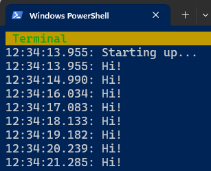

### Debugging

Terminal bazlı debug operasyonlarında GDB kullanılır.

```bash
# Klasik kontroller
cargo check
cargo build

# İlk terminalde aşağıdaki komut çalıştırılır ve flashing yapılır
cargo embed

# İkinci bir terminalde debug server'a bağlanılarak ilerlenir
arm-none-eabi-gdb .\target\thumbv7em-none-eabihf\debug\debugging

# gdb terminali açıldıktan sonra debug server'a bağlanılır
target remote :1337

# main.rs içerisinde bir satıra breakpoint eklemek için
break main.rs:12

# breakpoint noktasına gitmek için
continue

# local değişkenlerin durumunu görmek için
info locals

# Değişken değerini yazdırmak için
print counter
# Adresini öğrenmek için
print &counter
# Değer set etmek için
set var counter=0

# breakpoint'leri görmek için
info breakpoints

# ilk eklenen 1 numaralı breakpoint'i silmek için
delete 1

# Microdenetleyici register adreslerini görmek için
info registers

# Mikrodenetleyiciyi resetlemek için
monitor reset

# debugger'dan çıkmak için
quit
```

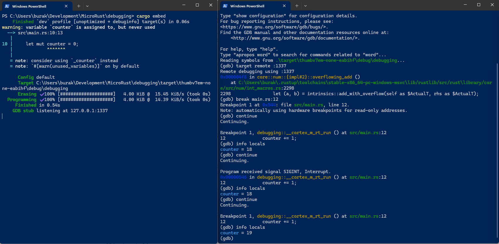

### Blinking Led

Bu örnekte 5x5 Led matrisinin ortasındaki led ışığının saniyede bir yanıp sönmesi sağlanır. Doğrudan mikrodenetleyicinin
GPIO adresleri üzerinde işlem yapılarak ilerlenmiştir.

```bash
cargo embed
```

Beklenen çıktı ortadaki led ışığının saniyede bir yanıp sönmesidir.

### Blinking Led v2

Blinking Led örneğindekinden farklı olarak bu örnekte **Hardware Abstraction Layer** crate'ler kullanılmıştır.

```bash
cargo embed
```

Beklenen çıktı ortadaki led ışığının yaklaşık 1.5 saniyelik sürelerde yanıp sönmesidir.

### Blinking Rust

Bu örnekte A düğmesine basıldığında LED matriste sırasyıla R, U , S ve T harfleri görünür.

```bash
cargo embed
```

Beklenen çıktı A düğmesine basıldığında LED ışıklarında RUST kelimesinin harflerinin sıralı bir şekilde görünmesidir.

### Beep

Bu örnekte ise B düğmesine basıldığında denetleyici üzerindeki hoparlörden beep benzeri bir ses çıkartılması
sağlanmaktadır.

```bash
cargo embed
```

Beklenen çıktı, B düğmesine basıldığında beep sesi duyulmasıdır.

### Uart

**UART _(Universal Asynchronous Receiver/Transmitter)_** mikrodenetleyici üzerinde yer alan bir çevresel iletişim
birimidir _(Peripheral)_. Bu arabirimi kullanarak mikrodenetleyici ve bilgisayar arasında haberleşme sağlanabilir. Modül
**Transmitter** ve **Receiver** için pin'lere sahiptir. Örneğin bilgisayarın **COM** portuna seri haberleşme protokolü
üzerinden mesaj gönderilebilir veya bilgisayardan dönen mesaj okunabilir.

```bash
# Microbit bilgisayar USB kablosu ile bağlandıktan sonra
# mode komutu ile COM port bilgileri alınabilir.
mode

# Flashing için
cargo embed
```

COM portuna gelen mesajları görmek için PuTTY uygulamasından yararlanılabilir. Uygulama ayarları aşağıdaki gibi
yapılandırılmalıdır.

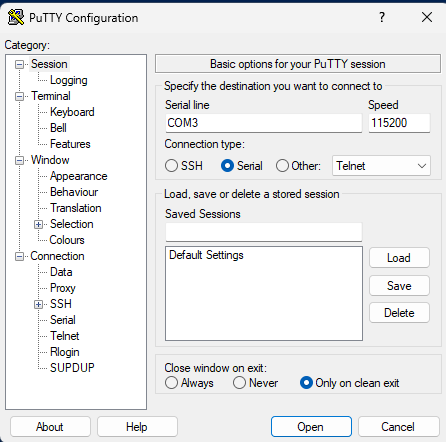

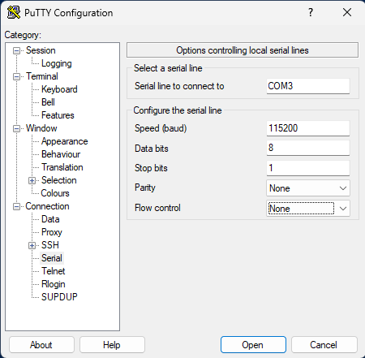

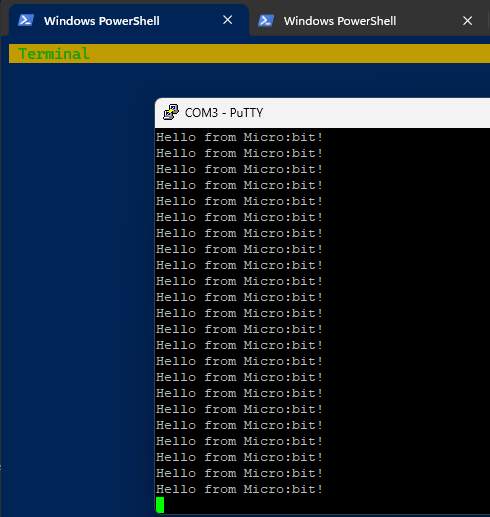

### Server

Bu örnekte mikrodenetleyici bir server rolünü üstlenir. Bilgisayar terminalinden gönderilen komutlara göre farklı
işlemler yapar. Komut gönderimi için bir önceki **uart** isimli örnekte olduğu gibi **PuTTY** ile **COM3** portuna
bağlanılan bir terminal açılır. Terminalde **h**, **o** ve **r** gibi tek karakterler gönderildiğinde mikrodenetleyici
bu komutlara karşılık işlemler yapar. Örneğin **o** harfi tuşlandığında **LED matrix**'te gülen surat yanar, **r**
harfine basılırsa LED resetlenir, **h** harfi ile yardım menüsü okunur.

```bash
cargo embed
```

Beklenen çalışma zamanı çıktısı;

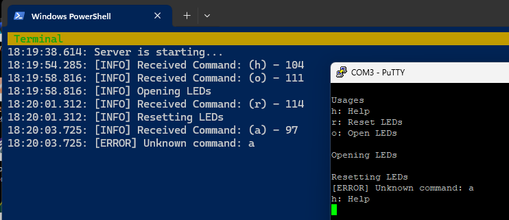

### Accelerometer

Bu örnekte microdenetleyici üzerinde yer alan ivme ölçer'den _(Accelerometer)_ anlık **x,y,z** değerlerinin okunması ve
bu bilgilerden yararlanarak hareket hızının ölçülmesi gerçekleştirilmektedir.

```bash
cargo embed
```

Beklenen çıktıya göre A düğmesine basılı iken terminal ekranına ivme artışlarının ve yaklaşık bir hız değerinin
yazılması beklenir.

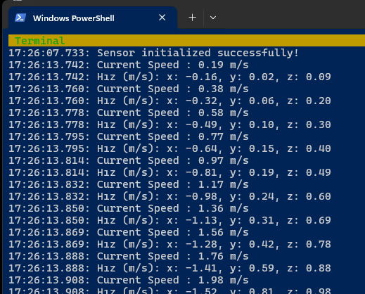

### Thermometer V1

Bu örnek micro:bit denetleyicisi üzerindeki LSM303AGR çipinin sıcaklığını ölçümler.

```bash
cargo embed
```

Beklenen çıktı mikrodenetleyici üzerindeki A butonuna basıldığında sıcaklık değerinin santigrat cinsidinden bilgisayar
terminalinde görülmesidir.

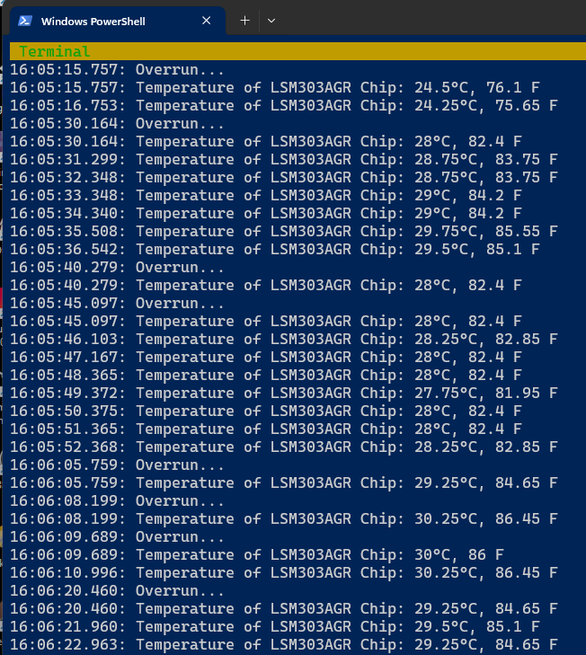

### Thermo2

Bu örnekte ortam sıcaklığı üzerinde ısı sensörü bulunan MonkMakes marka board yardımıyla ölçümlemneye çalışılacaktır.

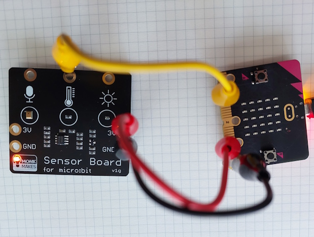

Board ve micro:bit arasındaki bağlantılar aşağıdaki gibidir.

| Timsah Klips | Micro:bit | Sensor |
|--------------|-----------|--------|
| Siyah        | GND       | GND    |
| Kırmızı      | 3V        | 3V     |
| Sarı         | GPIO 1    | Isı    |

```text
        [ MonkMakes Sensor ]
                 |
      +----------+----------+
      |          |          |
     GND        3V        Isı (OUT)
      |          |          |
      |          |          |
      |          |          |
    [GND]       [3V]     [GPIO1]
      |          |          |
      +----------+----------+
      [    micro:bit v2.2   ]
      |          |          |
    Siyah     Kırmızı      Sarı
```

```bash
cargo embed
```

Beklenen çıktı aşağıdakine benzerdir. Test şöyle yapılmıştır. Kartlar bilgisayarın fanına yakın bir yere
yerleştirilmiştir. Fana yakın olan MonkMakes sensörünün sıcaklık değerleri zamanla artış göstermiştir.

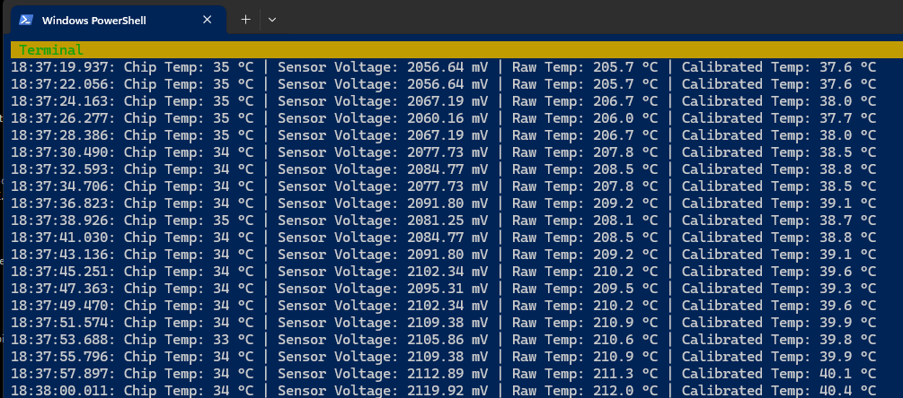

Sensörler oda ortamında aynı noktaya yerleştirildiklerinde ise sıcaklık değerleri yakınsamıştır.

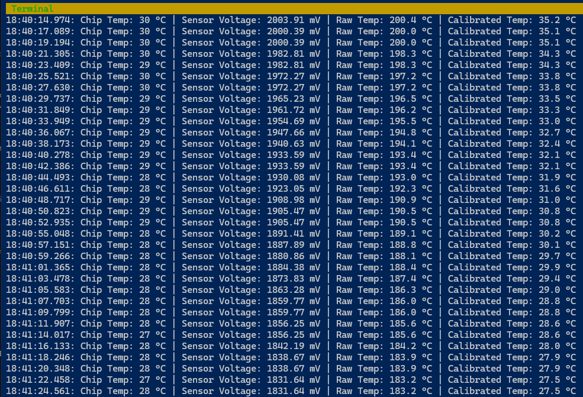

### Funny Led

Bu örnekte amaç kare, kalp, yukarı ok ve aşağı ok şekillerini LED matriste HAL kütüphanelerini kullanarak göstermektir.

```bash
cargo embed
```

### Thermo Digits

Thermo2 uygulamasının farklı bir versiyonudur. Isı değerleri LED matris ekranında kayan sayılar şeklinde gösterilir.

```bash
cargo embed
```

### Lighthouse

BBC Micro:bit ile gelen örnek projelerden birisi de denizfeneri uygulaması. Bu örnekte belli aralıklarda yanıp sönen bir
lamba söz konusu. Elimizdeki malzemeler şöyle.

- micro:bit
- MonkMakes Relay
- MonkMakes 1V Bulb
- 1.5 Volt kalem pil

Enstrümanlar arası bağlantılar yine timsah klipsler ile gerçekleştiriliyor. Aşağıdaki referans tabloyu baz alabiliriz.

| Timsah Klips | Micro:bit | Relay | Bulp | Pil(Batarya) |
|--------------|-----------|-------|------|--------------|
| Siyah        | GND       | GND   |      |              |
| Sarı         | GPIO 0    | IN    |      |              |
| Sarı         |           | OUT   | 2V   |              |
| Kırmızı      |           | OUT   |      | + Kutup      |
| Yeşil        |           |       | 1V   | - Kutup      |

Monkmakes resmi dokümanlarında için çalışan basit bir Python kodu da mevcut.

```python
from microbit import *

while True:
    pin0.write_digital(1)
    sleep(1000)
    pin0.write_digital(0)
    sleep(2000)

```

Düzeneğin çalışma zamanı ise aşağıdaki gibi.

Işık kapalı iken.

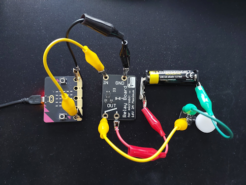

Işık açık iken.

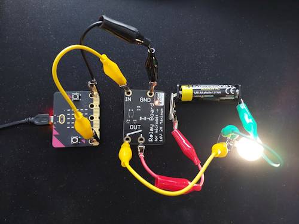

Mücadele; projeyi rust kodları ile geliştirmek.

### Morse Codes

Bu örnekte Lighthouse projesindeki düzenek kullanılarak mors kodlarına göre sinyal yayınlaması sağlanmakta. Örnekte
sadece HELLO kelimesini kullanıyoruz.

| Harf | Mors Kodu |
|------|-----------|
| H    | .-        |
| E    | .         |
| L    | .-..      |
| L    | .-..      |
| O    | - - -     |

Örneği cihaza almak için;

```bash
cargo embed
```

### Motion Sensor

Projedeki ilk amaç Micro:Bit'e haricen bağlanan speaker sensor'e ses sinyali gönderilmesini sağlamaktır. Eğer mümkün
olursa harekete duyarlı bir alarm mekanizması kullanılmaya çalışılacaktır.

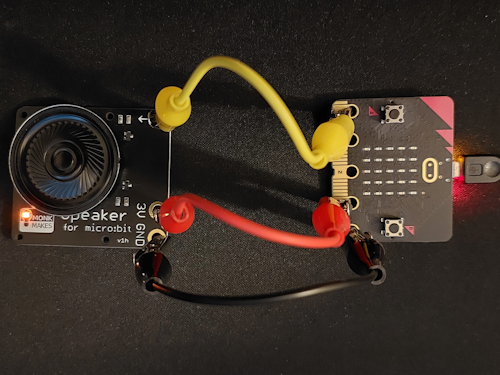

| Timsah Klips | Micro:bit | Speaker Sensor |
|--------------|-----------|----------------|
| Siyah        | GND       | GND            |
| Kırmızı      | 3V        | 3V             |
| Sarı         | GPIO 1    | Input          |

Mücadeledeki zorluklar;

1- Harekete duyarlı bir alarm mekanizması kodları MicroPython'a göre aşağıdaki kadar basittir.

```python
from microbit import *
import music

z=accelerometer.get_z()

while True:
    if accelerometer.get_z() < z -50:
        music.play(music.BA_DING)
```

2- Nota bazlı ses elde etmek için sesin frekansına göre kare sinyalleri doğru şekilde gönderebilmek gerekiyor.

## Mini Sözlük

- **ADC _(Analog-to-Digital Converter)_:** Analog sinyali dijitale çeviren dönüştürücüdür. Örneğin mikrofon sensörüne
  gelen veriyi dijital hale çevirmekte kullanılır.
- **Bare Metal Programming:** İşletim sistemi olmadan doğrudan donanım üzerinde yazılım geliştirme yaklaşımının adıdır.
  Yazıda ele aldığımız BBC micro:bit gibi cihazlarda **no_std** ile yazılan kodlar **bare-metal** seviyede olur.
- **BSP _(Board Support Package)_ :** Donanım kartına özel olarak geliştirilmiş başlangıç için gerekli tüm unsurları
  içeren paketlerin genel adıdır. Karta özel pin tanımlarını, saat ayarlarını, buton buzzer pin ayarlarını vb içerir.
  Örneğin **Micro:bit** kartı için kullandığımız **microbit-v2** BSP örneklerindendir. Bu tip paketler kullanılarak HAL
  katmanları da geliştirilebilir.
- **Debug Probe:** Bilgisayar ile mikrodenetleyici arasındaki fiziksel **debug** bağlantısını sağlayan araçtır.
- **ELF _(Executable and Linkable Format)_ :** Derlenen programın hedef sistemde çalıştırılabilir hale getirildiği dosya
  formatıdır.
- **Flashing:** Yazılan programın mikrodenetleyici üzerinde çalıştırılması genellikle Flash bellek bölgesine taşınması
  ile gerçekleştirilir. Bu işlem **flashing** olarak adlandırılır. **probe-rs** veya **openocd** gibi araçlarla yapılır.
- **GDB _(GNU Debugger)_ :** GNU ekosisteminde yaygın olarak kullanılan debugger.
- **GND _(Ground)_:** Devrelerde referans gerilim noktası olarak kullanılan ve bileşenlerin ortak kullandığı topraklama
  bağlantısıdır. Genellikle **0 Volt** kabul edilir ve sensörler/mikrodenetleyiciler aynı GND hattına bağlanarak
  çalışırlar _(3.3 volt, 5 Volt gibi)_
- **GPIO _(General Purpose Input/Output)_ :** Genel amaçlı giriş/çıkış pinleridir. LED yakmak, buton okumak,
  sensörlerden veri almak vb işlemlerde kullanılır. Hem giriş _(Input)_ hem de çıkış _(output)_ olarak
  yapılandırılabilir.
- **HAL _(Hardware Abstraction Layer)_ :** Donanım seviyesindeki enstrümanlarla konuşmayı kolaylaştıran bir arayüz
  olarak düşünülebilir. Örneğin **GPIO** pinlerine doğrudan erişmek yerine detaylardan uzak ve kolay kullanılabilir bir
  soyutlama sağlar. Buna göre pin registerlarına doğrudan erişmek yerine **pin.set_high** gibi anlamlı fonksiyonlar
  sağlar. Bazen BSP ile karıştırılabilir. **nrf52833-hal** küfesi örnek olarak verilebilir. Bu HAL örneğin belli
  mikrodenetleyicileri hedefler. Birde daha genel soyutlama sağlayan **embedded-hal** gibi küfeler _(crates)_ vardır.
  Şöyle de düşünebiliriz; **embedded-hal** genel arayüz tanımlamalarını içerir _(traits)_, **nrf52833-hal** ise *
  *nRF52833**'e özel trait'leri gerçekten implemente eder ve dolayısıyla cihaza özgü komutlar da içerebilir.
- **I2C _(Inter-Integrated Circuit)_:** Bir senkronize seri haberleşme protokolüdür. Veri değiş tokuşu için bir data
  hattı ve clock line kullanır. Örneğin Microbit kartı üzerinde yer alan **LSM303AGR** bileşeni manyetometre ve
  ivmeölçer hareket sensörlerini içerir. Bu çip veri iletişimi için **I2C** tabanlı bir arayüz sağlar. Dolayısıyla
  sensörlerden anlık verileri I2C protokolü üstünden kullanabiliriz.
- **MCU _(Microcontroller Unit)_ :** İşlemci çekirdeği, flash bellek, RAM ve çeşitli çevresel birimleri tek bir çipte
  barındıran elektronik birim olarak ifade edilebilir.
- **PAC _(Peripheral Access Crate)_ :** Mikrodenetleyici üreticisinin sağladığı register haritalarını, API'leri otomatik
  olarak Rust koduna çeviren paketlerdir. HAL kütüphaneleri genelde PAC modülleri üzerine kurulur.
- **Peripheral :** Mikrodenetleyicinin içinde bulunan **GPIO**, **UART**, **SPI**, **I2C**, **Timer**, **ADC** gibi
  birimlerdir. Her biri ayrı bir periferik modül olarak kabul edilir.
- **PWM _(Pulse Width Modulation)_:** PWM, **Pulse Width Modulation** anlamına gelir ve genellikle analog sinyalleri
  dijital sinyallere dönüştürmek için kullanılır. Bir sinyalin belirli bir süre boyunca açık kalma süresini _(duty
  cycle)_ kontrol ederek ortalama bir voltaj değeri oluşturur. Bu değer hoparlör gibi cihazların ses çıkışını kontrol
  etmek için kullanılabilir. Hatta bir **LED parlaklığını** kontrol etmek için de kullanılabilir.
- **Reset Vector:** Mikrodenetleyici yeniden başlatıldığında _(reset)_ çalışmaya başladığı ilk bellek adresidir.
  Başlangıç kodu da buradan çalıştırılır. Örneklerde embed edilen kodlar bu adresten başlatılır.
- **SAADC _(Successive Approximation Aanalog-to-Digital Converter)_ :** Analog sinyalleri dijital değerlere dönüştüren
  ve örnekleme sırasında ardışık yaklaşıklamalar kullanan bir **ADC** türüdür.
- **SPI _(Serial Peripheral Interface)_:** Ağırlıklı olarak yine mikrodenetleyicilerde ele alınan bir senkron ve seri
  haberleşme standardıdır.
- **SVD _(System View Description)_:** Mikrodenetleyici üzerindeki **register** ve ilişkili bitleri tarifleyen bir
  harita dosyası olarak düşünülebilir. **svd2rust** gibi crate'ler bu dosyaları **parse** edebilir ve bu da *
  *Peripherals Access Crate**'lerin oluşturulmasını kolaylaştırır. Genellikle **XML _(eXtensiable Markup Language)_**
  tabanlı bir dosyadır.
- **UART _(Universal Asynchronous Receiver-Transmitter)_:** Mikrodenetleyicilerde sensör verilerinin aktarım işlemlerini
  tanımlayan bir seri iletişim protokoldür. Sadece mikrodenetleyiciler değil bilgisayarlar içinde geçerlidir.

## Kaynaklar

- [Embedded Rust Docs - Discovery](https://docs.rust-embedded.org/discovery/microbit/index.html)
- [The Embedded Rust Book](https://docs.rust-embedded.org/book/intro/index.html)
- [A Freestanding Rust Binary](https://os.phil-opp.com/freestanding-rust-binary/#panic-implementation)
- [Ferrous System Embedding Training](https://github.com/ferrous-systems/embedded-trainings-2020)
- [Microbit Examples](https://github.com/nrf-rs/microbit/tree/03e97a2977d22f768794dd8b0a4b6677a70f119a/examples)
- [Microbit.org Hardware](https://tech.microbit.org/hardware/)
- [Micro:bit V2 için donanım şeması](https://github.com/microbit-foundation/microbit-v2-hardware/blob/main/V2.00/MicroBit_V2.0.0_S_schematic.PDF)
- [The Embedded Rustacean](https://www.theembeddedrustacean.com/)
- [Embedded programming in Rust with Microbit V2](https://www.youtube.com/watch?v=b7zWIKZp4ls)
- [nRF52833 Product Specification](https://docs-be.nordicsemi.com/bundle/ps_nrf52833/attach/nRF52833_PS_v1.7.pdf?_LANG=enus)
- [LSM303AGR](https://www.st.com/en/mems-and-sensors/lsm303agr.html)
- [MonkMakes Çevre Sensörü için Bilgiler](https://monkmakes.com/mb_2a)
